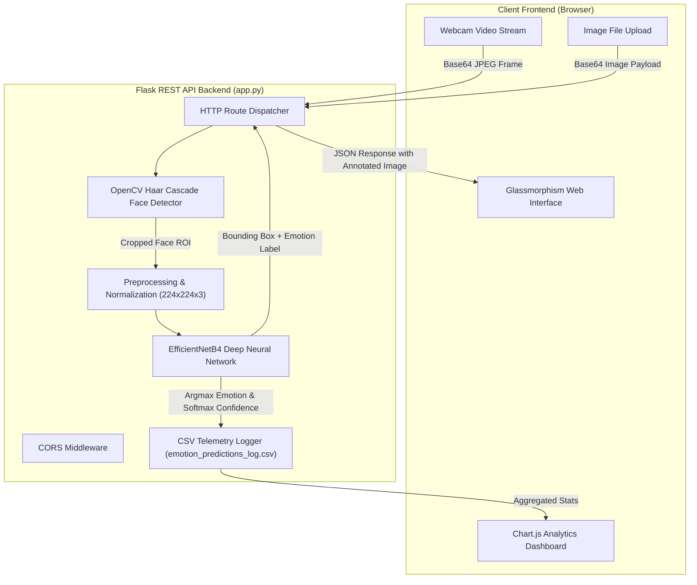

# Facial Emotion Recognition & Analytics System

> An end-to-end Computer Vision and Deep Learning web application utilizing Transfer Learning with EfficientNetB4, real-time Haar Cascade face detection, and a Flask analytics backend for facial emotion classification.

[](https://www.python.org/)
[](https://www.tensorflow.org/)
[](https://flask.palletsprojects.com/)
[](https://opencv.org/)

---

## Table of Contents

- [Overview](#overview)
- [System Architecture](#system-architecture)
- [Features](#features)
- [Tech Stack](#tech-stack)
- [Model Architecture & Training Pipeline](#model-architecture--training-pipeline)
- [Performance & Evaluation](#performance--evaluation)
- [Project Structure](#project-structure)
- [REST API Reference](#rest-api-reference)
- [Installation & Setup](#installation--setup)
- [Usage](#usage)
- [Screenshots & Visuals](#screenshots--visuals)
- [Author](#author)

---

## Overview

The **Facial Emotion Recognition System** is a full-stack deep learning solution that detects human faces in live webcam streams or uploaded static images, classifies their facial expressions across **6 emotion categories** (`Happy`, `Sad`, `Angry`, `Surprise`, `Neutral`, and `Ahegao`), and logs telemetry for interactive analytics.

The system addresses real-world classification challenges such as class imbalance and fine-grained visual differences by leveraging an **EfficientNetB4** backbone pre-trained on ImageNet with fine-tuned top layers, regularized dense classification heads, **Test-Time Augmentation (TTA)**, and class-weighted cross-entropy loss.

---

## System Architecture



---

## Features

- **Real-Time Webcam Inference**: Continuous live video processing via OpenCV client-server base64 frame streaming.
- **Static Image Upload & Processing**: Multi-face detection and classification on uploaded image files.
- **Deep Feature Representation**: Transfer learning with pre-trained EfficientNetB4 fine-tuned on custom facial expression datasets.
- **Class Imbalance Mitigation**: Class weighting and Test-Time Augmentation (TTA) to stabilize underrepresented emotions.
- **Live Visual Analytics**: Interactive Chart.js graphs displaying emotion distribution, total counts, and average prediction confidence.
- **Session Telemetry Logging**: Automatic timestamped recording of predictions and confidence scores to CSV for post-hoc analysis.

---

## Tech Stack

| Domain | Technologies |
|:---|:---|
| **Deep Learning & Frameworks** | TensorFlow 2.15+, Keras, EfficientNetB4 |
| **Computer Vision** | OpenCV (`cv2`), Haar Cascade Classifiers, Pillow (`PIL`) |
| **Data Processing & Analytics** | NumPy, Pandas, Scikit-learn, Pickle |
| **Backend & Serving** | Python 3, Flask 3.0.0, Flask-CORS 4.0.0 |
| **Frontend UI & Visualization** | HTML5, CSS3 (Glassmorphism), Vanilla JavaScript, Chart.js |

---

## Model Architecture & Training Pipeline

### Backbone & Custom Classification Head
The neural network consists of an EfficientNetB4 feature extractor followed by a custom multi-stage regularized dense classification head:

1. **Input Layer**: `(224, 224, 3)` normalized RGB image tensor.
2. **Backbone**: EfficientNetB4 pre-trained on ImageNet. The earliest layers are frozen while the top 150 layers are unfrozen for domain-specific fine-tuning.
3. **Global Average Pooling**: `GlobalAveragePooling2D()` spatial pooling.
4. **Dense Stage 1**: `Dense(1024, relu)` with $L_2$ kernel regularization ($\lambda = 0.001$), `BatchNormalization()`, and `Dropout(0.5)`.
5. **Dense Stage 2**: `Dense(512, relu)` with $L_2$ regularization, `BatchNormalization()`, and `Dropout(0.5)`.
6. **Dense Stage 3**: `Dense(256, relu)` with $L_2$ regularization, `BatchNormalization()`, and `Dropout(0.4)`.
7. **Dense Stage 4**: `Dense(128, relu)` with $L_2$ regularization, `BatchNormalization()`, and `Dropout(0.3)`.
8. **Output Layer**: `Dense(6, softmax)` outputting categorical probability distribution across the 6 emotion classes.

---

## Performance & Evaluation

The trained EfficientNetB4 architecture achieves a **71.41%** overall test accuracy on unseen test data with Test-Time Augmentation (TTA).

### Per-Class Test Performance

| Emotion Class | Accuracy (with TTA) | Sensitivity / Recall Category |
|:---|:---:|:---:|
| **Ahegao** | **90.00%** | High |
| **Happy** | **86.90%** | High |
| **Neutral** | **68.73%** | Moderate |
| **Surprise** | **64.23%** | Moderate |
| **Angry** | **63.64%** | Moderate |
| **Sad** | **58.63%** | Challenging |

---

## Project Structure

```bash
Facial-Emotion-Recognition/
├── assets/                                  # Architectural schematics, UI captures & evaluation plots
│   ├── Confusion_Matrix.png                 # Test set confusion matrix visualization
│   ├── Gemini_Generated_Image_tedtketedtketedt.png  # Deep learning pipeline schematic
│   ├── main_interface.jpg                   # Glassmorphism UI screenshot
│   ├── results.png                          # Training loss and accuracy progression curves
│   └── System_Analytics.png                 # Live analytics dashboard preview
├── backend/                                 # Flask backend microservice
│   ├── app.py                               # Application entrypoint & REST API routes
│   ├── class_labels.pkl                     # Serialized dictionary of categorical class indices
│   ├── emotion_predictions_log.csv          # Real-time inference audit log
│   └── requirements.txt                     # Backend Python package dependencies
├── frontend/                                # Client web interface
│   ├── css/
│   │   └── style.css                        # Glassmorphism theme and responsive grid layout
│   ├── js/
│   │   └── main.js                          # Webcam control, base64 payload handling & Chart.js rendering
│   └── index.html                           # Single-page interface markup
├── Facial Emotion Recognition.ipynb         # End-to-end Jupyter research, training & validation notebook
├── .gitignore                               # Git exclusion rules
└── README.md                                # Comprehensive system documentation
```

---

## REST API Reference

The Flask application exposes the following HTTP endpoints on `http://localhost:5000`:

| Method | Endpoint | Description | Request Payload | Response Schema |
|:---|:---|:---|:---|:---|
| `GET` | `/` | Serves the main frontend Single Page Application (`index.html`) | None | HTML document |
| `GET` | `/<path>` | Serves static frontend assets (`css/style.css`, `js/main.js`) | Path parameter | Static file |
| `POST` | `/api/predict` | Runs Haar Cascade face detection + emotion classification | `{"image": "data:image/jpeg;base64,..."}` | `{"success": true, "image": "data:image/jpeg;base64,...", "faces": [{"x", "y", "w", "h", "emotion", "confidence"}], "count": N}` |
| `GET` | `/api/stats` | Aggregates distribution counts and average confidence | None | `{"success": true, "total": N, "emotions": {"Happy": X, ...}, "avg_confidence": Y}` |
| `GET` | `/api/data` | Returns all prediction records logged in CSV | None | `{"success": true, "data": [{"Timestamp", "Emotion", "Confidence", "Source"}]}` |
| `POST` | `/api/clear` | Removes the current CSV telemetry log file | None | `{"success": true, "message": "Data cleared"}` |

---

## Installation & Setup

### Prerequisites
- Python 3.10 or newer
- Virtual environment tool (`venv`)
- Webcam (optional, required for real-time video streaming)

### 1. Clone the Repository
```bash
git clone https://github.com/Eng-Ghanem/Facial-Emotion-Recognition.git
cd Facial-Emotion-Recognition
```

### 2. Configure Virtual Environment & Install Dependencies
```bash
cd backend
python -m venv venv

# On Windows:
.\venv\Scripts\activate

# On Linux/macOS:
source venv/bin/activate

pip install -r requirements.txt
```

---

## Usage

### Running the Web Server
Ensure the trained model weights file (`final_emotion_model_weights.h5`) is placed in the `backend/` directory:
```bash
cd backend
python app.py
```
Open your web browser and navigate to:
```
http://localhost:5000
```

1. **Webcam Mode**: Click "Start Camera" to initiate zero-latency real-time video processing.
2. **Upload Mode**: Select any image file (`.jpg`, `.png`) to perform offline multi-face detection and classification.
3. **Analytics**: Review live distribution metrics and confidence averages in the Chart.js panel.

---

## Screenshots & Visuals

### Main User Interface


### Model Architecture & Deep Learning Pipeline


### Training Evaluation & Confusion Matrix


### Real-Time System Analytics Dashboard


---

## Author

- **Mohamed Ghanem**
  - **GitHub**: [Eng-Ghanem](https://github.com/Eng-Ghanem)
  - **LinkedIn**: [Mohamed Ghanem](https://www.linkedin.com/in/mohamed-ghanem-88346538a)
  - **Email**: [mohamed.ghanem26g@gmail.com](mailto:mohamed.ghanem26g@gmail.com)
